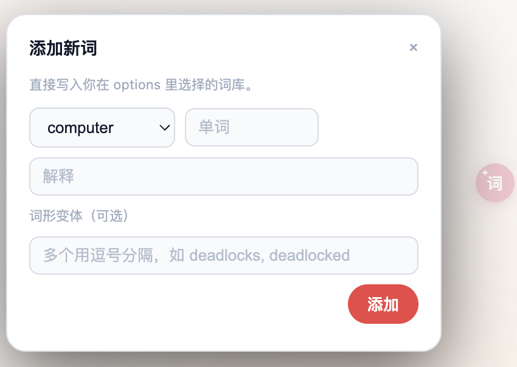
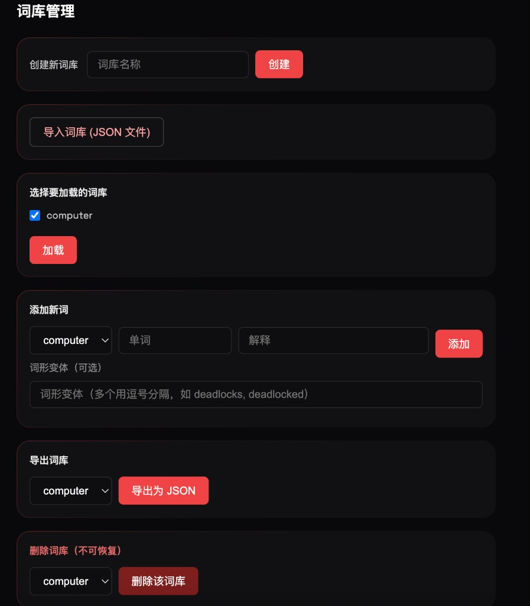

# [bai-it 增强版（浏览器扩展）](https://bai-it.app/#download)


原作者项目二创版，已获得原作者同意  
在保留核心功能的基础上，对性能、兼容性和自定义词库做了大量增强。

[原作者仓库](https://github.com/CapeAga/bai-it.git) · [官网链接](https://bai-it.app/#download)

---

### ✨ 为什么要做这个增强版？

很多技术文档/官网的前端结构各不相同，原项目在部分网站上效果不理想，同时也存在以下问题：

1. **内存占用偏大**：每开一个新标签页都会复制一份词库，占用明显增加。
2. **不支持自定义词库**：无法为自己的专业领域维护单词本。
3. **部分网站兼容性一般**：有些页面无法正常标记与使用。

因此做了这个「增强版」，在不改变原有核心体验的前提下，重点改进性能与可定制能力。

---

### 🚀 我做了哪些改进？

1. **网页兼容性优化**
  - 针对常见技术站点和文档站点做了适配与修复。  
  - 目前大部分网站都可以正常标记与使用。
2. **大幅降低内存占用**
  - 将词库统一加载到浏览器后台进程。  
  - 所有标签页**共用同一套词库**，实测单标签页可节省 **20MB+ 内存**。
3. **支持自定义词库**
  - 可以自己创建多个词库（例如：前端 / 后端 / 数学 / 医学等）。  
  - 可以为指定词库自由添加、管理单词。
4. **悬浮球快速入口**
  - 页面右侧（或某个固定位置）提供一个小小的悬浮球。  
  - 点击悬浮球即可呼出「添加新单词」的页面，随时记录当前页面遇到的新词。
5. **词库导入 / 导出**
  - 支持将当前词库**一键导出为文件**。  
  - 在新电脑或新浏览器上，通过导入文件即可完整恢复。  
  - 未来可以和他人共享词库，逐步形成各个领域的词库生态。

#### 💡 「添加新词」悬浮框预览

<p align="center">
  
</p>

#### 📚 词库管理页面

<p align="center">
  
</p>

---

### 📦 安装方式

> 目前以 Chrome / Edge 浏览器为例，其他支持 `Chrome Extension` 的浏览器步骤类似。

1. **拉取代码**

```bash
git clone https://github.com/HW-Yue/bai-it.git
cd 你的仓库名
```

1. **在浏览器中加载扩展（以 Chrome / Edge 为例）**

- **Chrome**  
1）在地址栏输入 `chrome://extensions/` 打开扩展管理页  
2）右上角打开「开发者模式」  
3）点击「加载已解压的扩展程序」  
4）选择刚才 `git clone` 下来的项目根目录（例如：`bai-it-v0.3.1`）  
- **Edge**  
1）在地址栏输入 `edge://extensions/` 打开扩展管理页  
2）左下角打开「开发人员模式」  
3）点击「加载解压缩的扩展」  
4）同样选择项目根目录（例如：`bai-it-v0.3.1`）

加载成功后，你应当能在浏览器工具栏看到 `bai-it` 的图标，同时在网页右侧看到用于快速添加单词的悬浮球。

如果你是从官网 `[https://bai-it.app](https://bai-it.app/#download)` 下载的离线包，解压后同样按照上述「加载已解压扩展」的步骤操作即可，无需 `git clone`。